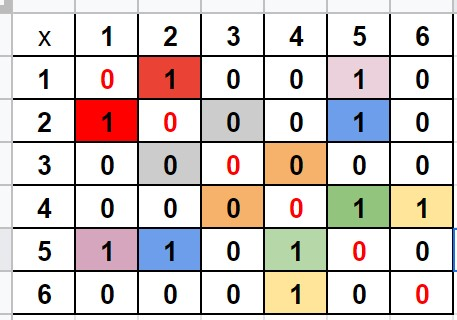
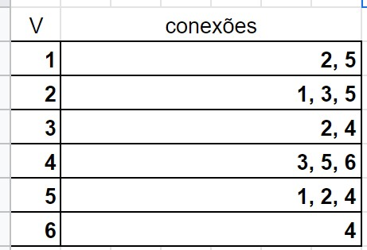

# Grafos

Temos duas maneiras principais de representar os grafos:

## 1. Matriz de Adjcência

Nesta maneira, nós iremos criar uma associação na matriz através de (linha, coluna), indicando um caminho no grafo.

## 2. Lista de Adjacência

Nesta maneira, falamos que cada vértice tem uma lista de vértices conectados a ele, e por isso podemos fazer um vetor com os vértices, onde cada vértice tem uma lista de outros vértices.

